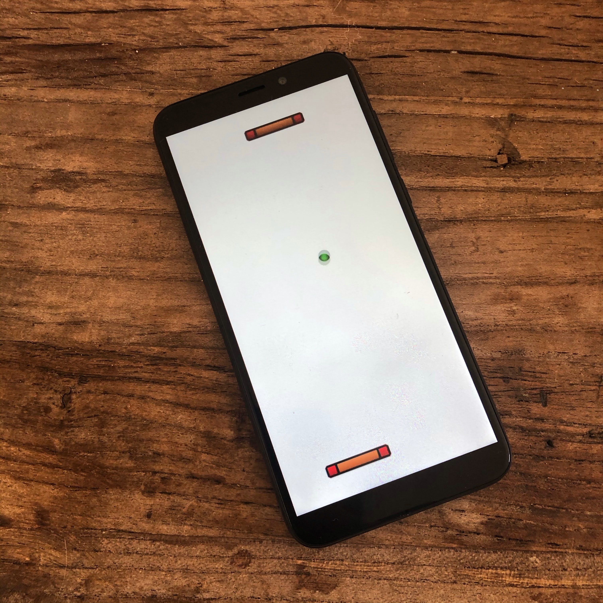

# Mochi :dango: 

A game engine oriented toward low power mobile linux phones/tablets.  It's written in Rust and uses Gtk and Cairo! All drawing is done with an [Cairo Context](https://gtk-rs.org/docs/cairo/struct.Context.html) that this library has extended to do some really [common graphics operations](https://docs.rs/mochi/latest/mochi/trait.MochiCairoExt.html).

<a href="https://docs.rs/mochi"></a>

- [x] atlases
- [ ] animated sprites



```
[dependencies]
mochi = "0.0"
```

```rust
init(include_bytes!("game.gresource"));

let img_mochi = image_from_resource("/game/mochi.png");
let img_mochi_eaten = image_from_resource("/game/mochi_eaten.png");

run_game(move |window, ctx, pointer, delta_time| {
    if pointer.is_down() {
        ctx.draw_image_centered(window.width / 2.0, window.height / 2.0, img_mochi_eaten);
    } else {
        ctx.draw_image_centered(window.width / 2.0, window.height / 2.0, img_mochi);
    }
});
```

# How to build a game

Mochi works off resources put into a Glib resource file. This is pretty simple to do.  Just make an xml file that references your images:

```xml
<?xml version="1.0" encoding="UTF-8"?>
<gresources>
  <gresource prefix="/pong">
    <file>ball.png</file>
    <file>paddle.png</file>
  </gresource>
</gresources>
```

Build into a `gresource` file that Glib can understand:

```rust
glib-compile-resources game.xml
```

Inline the bytes of the `game.gresource` into your code during init:

```rust
init(include_bytes!("game.gresource"));
```

Now your game has everything it needs in it's binary! The images can be acquired as needed using the resource paths you setup.

```rust
let img_ball = image_from_resource("/pong/ball.png");
```

# License

This project is licensed under either of

 * Apache License, Version 2.0, ([LICENSE_APACHE](LICENSE_APACHE) or
   http://www.apache.org/licenses/LICENSE-2.0)
 * MIT license ([LICENSE_MIT](LICENSE_MIT) or
   http://opensource.org/licenses/MIT)

at your option.

### Contribution

Unless you explicitly state otherwise, any contribution intentionally submitted
for inclusion in `mochi` by you, as defined in the Apache-2.0 license, shall be
dual licensed as above, without any additional terms or conditions.
